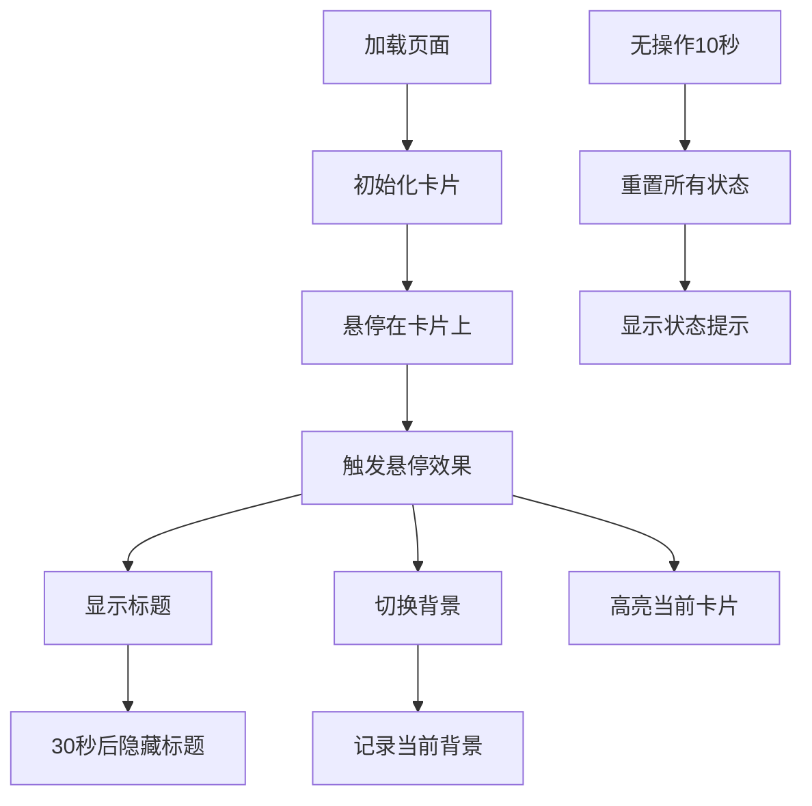

# 3D立体卡片画廊 - 实现文档

## 项目概述
这个3D立体卡片画廊展示了创新的交互式卡片设计，卡片悬浮效果、3D视差变换和动态背景切换为主要特色。当用户悬停在卡片上时，会触发多种视觉效果和交互反馈。


## 关键功能实现解析

### 1. 3D悬浮卡片效果
卡片具有复杂的CSS 3D变换，通过多层CSS变量控制不同视觉效果：

```css
.orbit-card {
  transform-style: preserve-3d;
  --tilt-angle: 6deg; /* 全局倾斜角度 */
  --hover-tilt: 0deg; /* 悬停倾斜角度 */
  --card-brightness: 1.0; /* 亮度控制 */
  --shadow-intensity: 1.0; /* 阴影强度 */
  --depth-intensity: 1.0; /* 深度效果 */
  --highlight-intensity: 0.3; /* 高光强度 */
  --card-opacity: 0.5; /* 透明度 */
}
```

### 2. 裸眼3D效果
当鼠标在卡片上移动时，JS计算鼠标位置实现3D视差变换：

```javascript
card.addEventListener('mousemove', function (e) {
  const rect = this.getBoundingClientRect();
  const x = e.clientX - rect.left;
  const mouseX = (x - rect.width / 2) / (rect.width / 2);
  
  const maxRotate = 10;
  const rotateY = mouseX * maxRotate;
  
  this.style.setProperty('--mouse-rotate-y', `${rotateY}deg`);
});
```

### 3. 交互系统
- **悬停高亮**：当前卡片激活时不透明，其他卡片半透明
- **动态背景切换**：悬停卡片时背景切换为对应图片
- **标题显示计时器**：30秒后自动隐藏标题
- **无操作自动重置**：10秒无操作恢复初始状态

### 4. 平滑状态切换
卡片状态变化时使用贝塞尔曲线实现平滑过渡：

```css
transition: transform 0.6s cubic-bezier(0.175, 0.885, 0.32, 1.275);
```

## 文件结构
```
3D立体卡片画廊/
├── index.html                   # 主HTML文件
├── style.css                    # 样式文件（嵌入在HTML中）
├── script.js                    # 交互脚本（嵌入在HTML中）
└── image/                       # 图片资源目录
    ├── 灰原哀1.png
    ├── miku.d66461fc.jpeg
    └── ななみ.c4dafa62.jpeg
```

## 使用说明
1. 悬停在卡片上：查看裸眼3D效果和背景切换
2. 移动鼠标：体验卡片的3D旋转效果
3. 无操作10秒后：系统将自动重置所有卡片
4. 右下角提示框：显示状态变更信息

## 性能优化点
1. 使用`requestAnimationFrame`实现平滑的角度重置动画
2. `transform`取代位置变化属性优化渲染性能
3. 图片预加载确保背景切换流畅
4. 状态变更提示使用CSS动画而非JS操作DOM

## 响应式设计
通过媒体查询实现移动设备适配：

```css
@media (max-width: 768px) {
  .orbit-card {
    width: 280px;
    height: 400px;
  }
}
```

## 交互流程图

